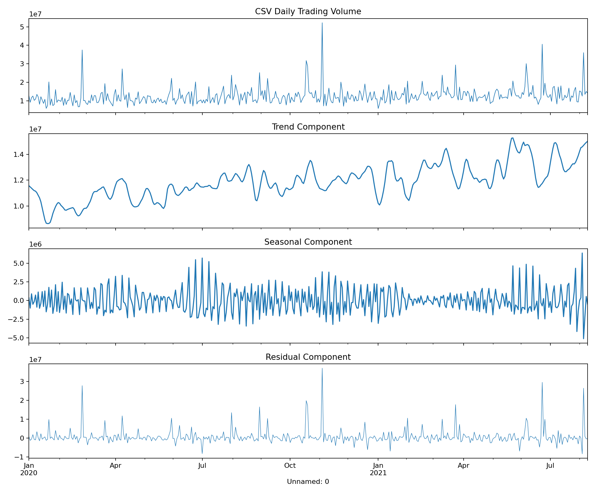
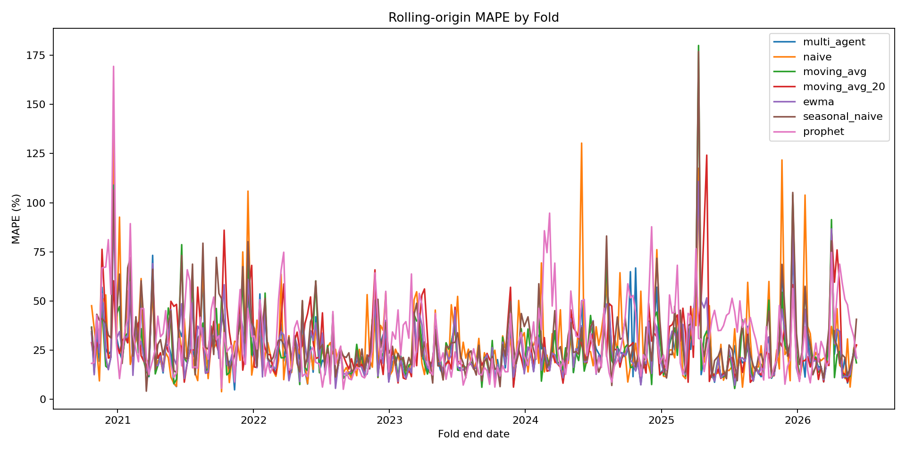
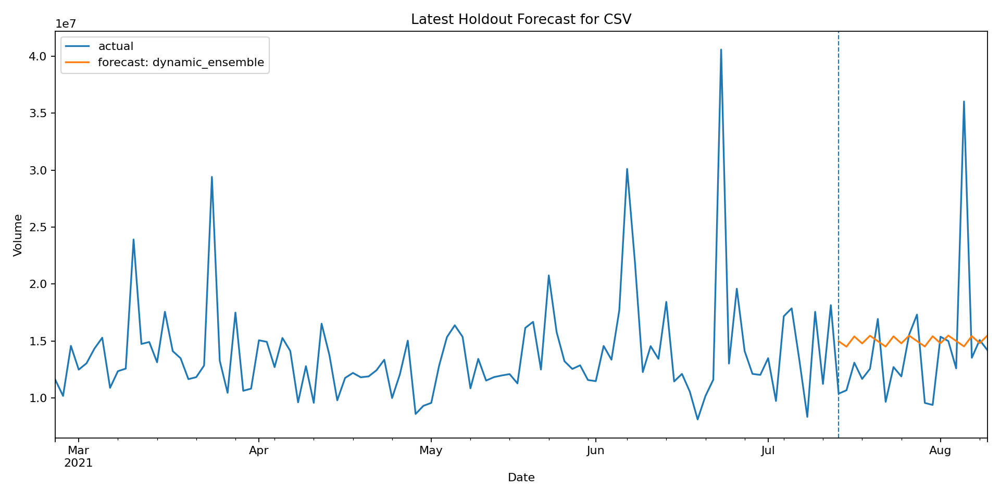

# Multi-Agent Trading Volume Forecasting

A 5-agent forecasting system for daily stock trading volume. The system decomposes volume into trend, seasonal, and residual components, then uses a dynamic coordinator to decide whether the decomposed forecast, a robust baseline, or a validation-weighted ensemble is most reliable for the next forecast window.

## Objective

Build a volume forecasting pipeline that is stronger than a fixed decomposition model by combining specialized agents with validation-based model selection. Trading volume is used instead of stock price because volume has stronger repeatable structure: trend, weekly seasonality, and event-driven spikes.

## Approach

| Agent | Role |
|---|---|
| Decomposition Agent | Uses STL to split the series into trend, seasonal, and residual components. |
| Trend Agent | Chooses a stable trend forecaster using recent validation performance. |
| Seasonal Agent | Learns recurring trading-week patterns and validates candidate periods. |
| Residual Agent | Uses shrinked lag regression only when residual forecasting improves validation error. |
| Coordinator Agent | Scores all candidate forecasts on recent rolling validation folds and outputs the best dynamic forecast or a weighted ensemble. |

The key improvement is that the final prediction is no longer a blind sum of trend + seasonal + residual. The coordinator compares component forecasts against naive persistence, moving averages, EWMA, seasonal naive, and shrunk decomposition candidates before deciding what to trust.

## Project Structure

```text
5-Multi-Agent-Forecasting/
├── agents/
│   ├── decomposition_agent.py
│   ├── trend_agent.py
│   ├── seasonal_agent.py
│   ├── residual_agent.py
│   └── coordinator.py
├── baselines/
│   └── baselines.py
├── evaluation/
│   ├── metrics.py
│   └── backtest.py
├── notebooks/
├── data/
├── results/
├── data_loader.py
├── run_pipeline.py
├── update_readme_results.py
├── requirements.txt
└── README.md
```

## Outcome

Running the pipeline writes the rolling backtest table, headline metrics, and graphs into `results/`. The README is updated automatically after each run.

<!-- RESULTS_START -->
### Latest generated results

| Model | MAPE ↓ | RMSE ↓ | MAE ↓ | Runtime sec ↓ |
|---|---:|---:|---:|---:|
| Multi Agent | 25.212 | 22,022,293.370 | 18,754,464.983 | 0.871 |
| Naive | 27.928 | 23,823,458.591 | 20,551,693.922 | - |
| Moving Avg | 26.236 | 22,486,255.297 | 19,445,310.883 | - |
| Seasonal Naive | 30.290 | 26,948,711.861 | 22,469,611.519 | - |
| Prophet | 30.854 | 25,161,765.913 | 22,141,025.557 | 0.638 |

### Agent contribution ablation

Positive RMSE contribution means removing that component worsened the forecast.

| Component | Avg RMSE degradation ↑ |
|---|---:|
| Trend Agent | -2,049.751 |
| Seasonal Agent | 0.000 |
| Residual Agent | 1,313,751.968 |

**Dynamic model selection frequency**

- `dynamic_ensemble`: 100.0% of folds

### Generated plots






<!-- RESULTS_END -->

## Setup

```bash
git clone https://github.com/technocat00/5-Multi-Agent-Forecasting.git
cd 5-Multi-Agent-Forecasting
python -m venv .venv
source .venv/Scripts/activate
pip install -r requirements.txt
```

For PowerShell on Windows:

```powershell
.\.venv\Scripts\Activate.ps1
```

## Usage

Full run with Prophet:

```bash
python run_pipeline.py --ticker SPY --start 2018-01-01
```

Faster development run without Prophet:

```bash
python run_pipeline.py --ticker SPY --start 2018-01-01 --no_prophet
```

Run on a local CSV:

```bash
python run_pipeline.py --input_csv data/spy_volume.csv --date_col Date --value_col Volume --no_prophet
```

## Generated Outputs

```text
results/decomposition.png
results/backtest_mape.png
results/forecast_comparison.png
results/backtest_results.csv
results/summary_metrics.csv
```

## Why the dynamic coordinator matters

A pure decomposition model can fail badly when trend extrapolation or residual regression overreacts to volume spikes. The coordinator prevents that by scoring recent rolling validation folds and selecting the forecast family that is currently behaving best. This keeps the system close to the strongest simple baseline when decomposition is not helping, while still allowing the component agents to contribute when they improve validation performance.

## Notes

- Lower MAPE, RMSE, and MAE are better.
- `selected_model` in `results/backtest_results.csv` shows what the coordinator chose for each fold.
- The final metric is still produced by rolling-origin backtesting, not by a single train/test split.
## Author
Diya Arora
